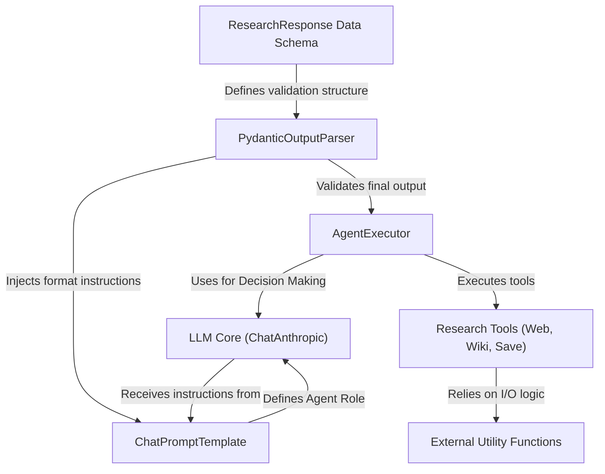
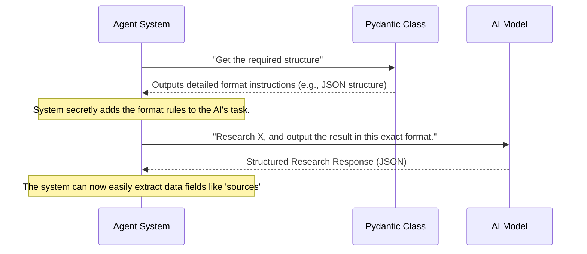
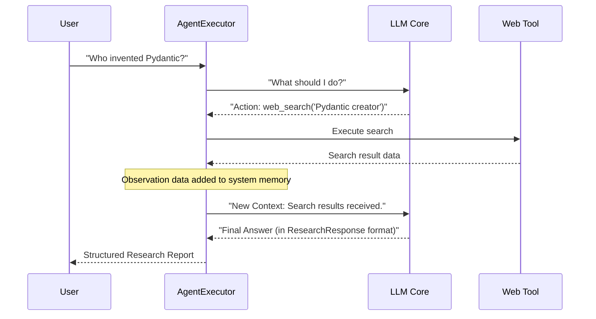
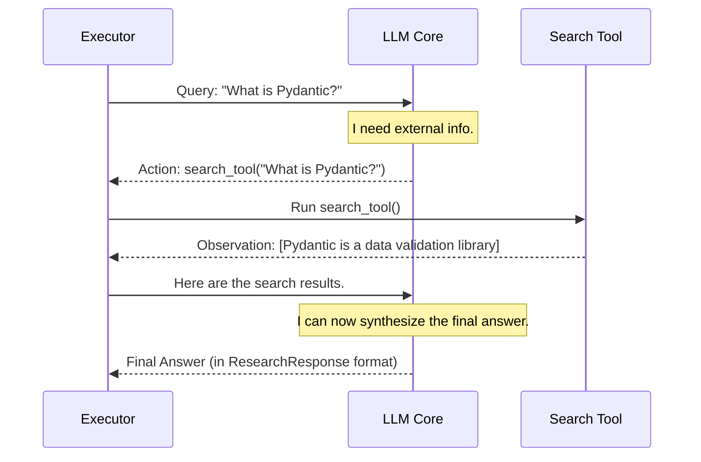
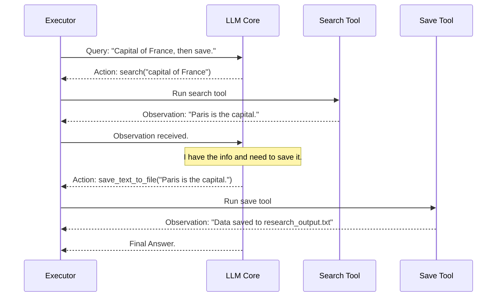
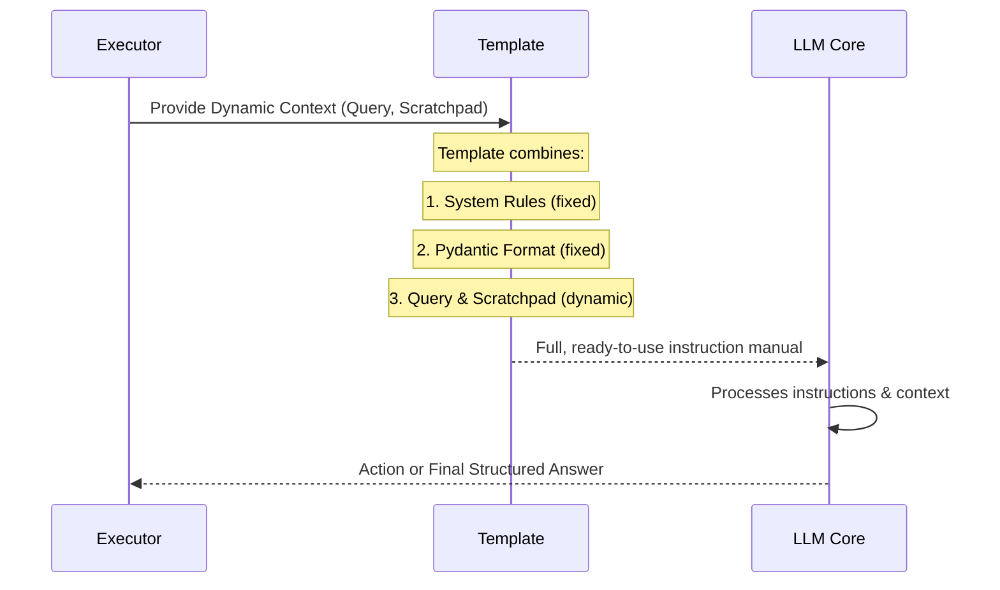
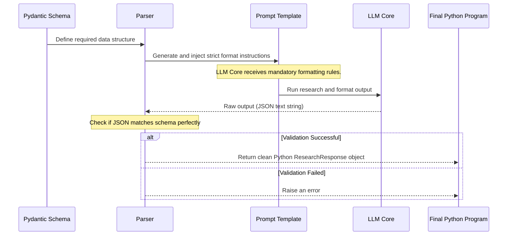
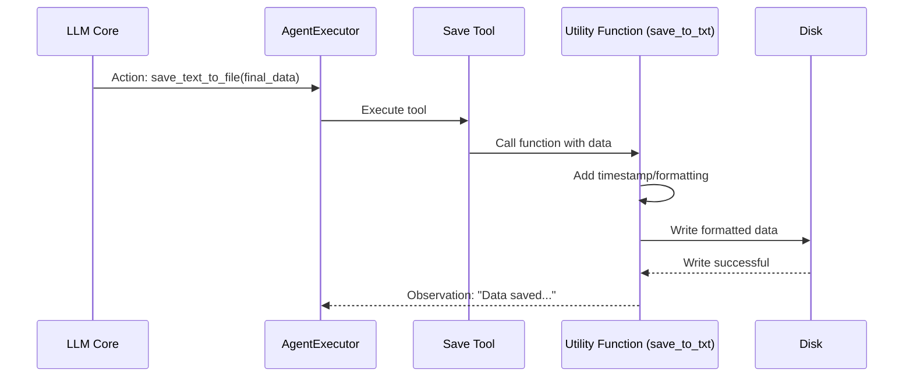

# WebSearch_Agent

This project implements a **WebSearch_Agent**, acting as an intelligent *research assistant*. It uses the LLM Core (Claude) as its brain to analyze user questions and orchestrate the use of specialized *Research Tools* (like web search and Wikipedia). The central **AgentExecutor** manages this loop until the information is synthesized and strictly formatted according to the *ResearchResponse Data Schema* and verified by the output parser.


## Visual Overview



## Chapters

1. [ResearchResponse Data Schema
](#researchresponse_data_schema_.md)
2. [AgentExecutor
](02_agentexecutor_.md)
3. [LLM Core (ChatAnthropic)
](03_llm_core__chatanthropic__.md)
4. [Research Tools (Web, Wiki, Save)
](04_research_tools__web__wiki__save__.md)
5. [ChatPromptTemplate
](05_chatprompttemplate_.md)
6. [PydanticOutputParser
](06_pydanticoutputparser_.md)

# Chapter 1: ResearchResponse Data Schema

Welcome to the first chapter of our tutorial! Before we build a powerful AI research agent, we must first define the rules for its output. Imagine hiring a research assistant: you wouldn't want them to send back a random, messy document. You need a structured report!

That is exactly the purpose of the **ResearchResponse Data Schema**. It is the strict, mandatory blueprint for how our AI agent must deliver its final research findings.

## Why Do We Need a Strict Blueprint? (The Problem Solved)

When a Large Language Model (LLM) finishes a task, it usually provides the answer as a long block of text. This is great for humans to read, but terrible for computer programs to use.

**Use Case:** We need our research agent to find information about "The History of Pydantic" and save the sources separately.

If the AI just returns: "Pydantic was invented in 2017. Here are the links: [link1], [link2]...", it’s difficult for our program to automatically grab just the links or just the summary.

By enforcing a **Data Schema**, we force the AI to deliver its results in a predictable, structured format (like JSON), allowing our Python code to handle the data reliably.

## Defining the Blueprint with Pydantic

In our project, we use a Python library called **Pydantic** to define this strict structure. Pydantic allows us to create a Python class that acts like a data contract.

Here is the entire definition of our output structure, found in `main.py`:

```python
# main.py (simplified)
from pydantic import BaseModel

class ResearchResponse(BaseModel):
    topic: str
    summary: str
    sources: list[str]
    tools_used: list[str]
```

Let's break down what this code means:

1.  `class ResearchResponse(BaseModel):`
    *   `BaseModel` is the special ingredient from Pydantic that gives our class superpowers, turning it into a structure validator.
2.  `topic: str`: This field must exist and contain a single piece of text (string).
3.  `sources: list[str]`: This field must exist and contain a **list** of text pieces (strings). For example: `["url1", "url2", "url3"]`.

The AI cannot skip any of these fields, and it cannot change their types.

### Required Fields Explained

Think of the `ResearchResponse` class as the required cover sheet for the AI's final report:

| Field | Purpose in the Research Report | Required Data Type |
| :--- | :--- | :--- |
| `topic` | What the user originally asked for. | Single string (text) |
| `summary` | The main findings of the research. | Single string (text) |
| `sources` | A list of all URLs or citations used. | List of strings |
| `tools_used` | Records which tools (like web search) were activated. | List of strings |

## How the Schema Enforces Structure

The magic happens when the `ResearchResponse` class is converted into instructions that the LLM (our AI) can understand.

This conversion is handled by the [PydanticOutputParser](06_pydanticoutputparser_.md), which takes our friendly Python class and translates it into very specific formatting requirements (usually a JSON structure) for the AI.

Here is a simplified look at the process:



If the AI model returns its answer *without* this structure, our system will reject it because it fails the Pydantic validation check. This ensures that every piece of research delivered is clean and immediately usable by the rest of our Python program.

In the [ChatPromptTemplate](05_chatprompttemplate_.md) chapter, you will see exactly how these format instructions (`{format_instructions}`) are injected into the system prompt to guide the AI.

```python
# Snippet showing the system prompt instructions
# Note the {format_instructions} placeholder
(
    "system",
    """
    You are a research assistant... 
    Wrap the output in this format and provide no other text\n{format_instructions}
    """,
),
# ...
```

By defining the `ResearchResponse` first, we set the stage for reliable and predictable research outcomes.

# Chapter 2: AgentExecutor

Welcome to Chapter 2! In the previous chapter, we established the strict rules for our AI's final report using the [ResearchResponse Data Schema](01_researchresponse_data_schema_.md). That schema guarantees a structured output.

Now, we need the brain that orchestrates the entire research process to fill out that report. That brain is the **AgentExecutor**.

## The Orchestra Conductor of the Agent System

If our AI system were an orchestra, the Large Language Model (LLM) is the creative composer, and the tools (like web search) are the musicians. The **AgentExecutor** is the **Conductor** or **Shift Manager**.

Its job is not to generate text or use the tools directly, but to manage the entire workflow:

1.  Listen to the user’s request.
2.  Hand the request to the LLM (the brain).
3.  Receive the LLM’s decision (e.g., "Use the Web Search tool").
4.  Execute that tool.
5.  Take the result from the tool and pass it back to the LLM for the next step.
6.  Repeat this process until the final answer is ready.

The AgentExecutor is the central control loop that allows the AI to *think* and then *act* in a continuous cycle.

## The Core Job: The Research Loop

The magic of an agent is its ability to perform multiple steps without human intervention. The AgentExecutor makes this possible through a cycle known as the **"Action Loop."**

Here is what happens every time you ask the AgentExecutor a question:

| Step | Who is Responsible? | Action Taken |
| :--- | :--- | :--- |
| **1. Request** | User / AgentExecutor | Receives the user query ("Who invented LangChain?"). |
| **2. Decision** | LLM Core (Brain) | Decides which tool is best based on the prompt. |
| **3. Execution** | AgentExecutor | Calls and runs the chosen tool (e.g., `search_tool("LangChain creator")`). |
| **4. Observation** | AgentExecutor | Captures the output (the search results). |
| **5. Iteration** | AgentExecutor | Sends the search results back to the LLM's brain for the next decision. |
| **6. Final Answer** | LLM Core (Brain) | Once enough data is gathered, the LLM generates the final, structured [ResearchResponse Data Schema](01_researchresponse_data_schema_.md). |

The AgentExecutor ensures this loop runs until the LLM signals that the final, complete answer has been generated.

## Setting Up the Control Room in `main.py`

In our project, the `AgentExecutor` brings together the LLM’s logic (which we call the `agent`) and the list of available research tools.

First, we need the list of tools defined in the project:

```python
# main.py snippet: Tools list
from tools import search_tool, wiki_tool, save_tool
# ... more code ...

# This is the list of instruments our conductor can manage
tools = [search_tool, wiki_tool, save_tool]
```

Next, we initialize the AgentExecutor. Notice that we give it two critical pieces of information: the `agent` (the logic we define later) and the list of `tools`.

```python
# main.py snippet: Initializing the Executor
# 'agent' is created in a separate step using 'create_tool_calling_agent'
# This combines the LLM, the prompt, and the tool definitions.

agent_executor = AgentExecutor(
    agent=agent, 
    tools=tools, 
    verbose=True
)
```

### The Power of `verbose=True`

The most important setting for beginners here is `verbose=True`. When set to True, the AgentExecutor prints out the entire internal conversation that happens during the Action Loop.

It lets you see the "shift manager's notes"—the exact moment the LLM decides to use a tool, the input it gives the tool, and the observation (result) it receives back.

## Running the Research

To start the AgentExecutor, we call the `.invoke()` method and provide the user's question as the `query`:

```python
# main.py snippet: Invoking the Executor
query = input("What can i help you research? ")

# The Executor starts the loop and runs until a result is generated
raw_response = agent_executor.invoke({"query": query})

# The result is now in 'raw_response'
# It will contain the final structured output from the LLM
```

If you run this code and use `verbose=True`, you will see something like this in your terminal:

```
> Entering new AgentExecutor chain ...
Thinking: I need to use the web search tool to find information...
Action: web_search
Action Input: Who created LangChain
Observation: [The result from the search tool: Harrison Chase]
Thinking: I have found the answer. I will now format the final response.
> Finished chain.
```
This entire sequence, from the first `Thinking:` to the `Finished chain.`, is controlled and managed by the **AgentExecutor**.

## Visualizing the Control Loop

Here is a simplified diagram showing how the AgentExecutor controls the flow between the different components we have discussed or will discuss:



# Chapter 3: LLM Core (ChatAnthropic)

Welcome to Chapter 3! In the previous chapter, we introduced the [AgentExecutor](02_agentexecutor_.md), the "shift manager" that handles the research workflow. But a shift manager is useless without a powerful brain to tell it what to do.

This chapter introduces the **LLM Core (ChatAnthropic)**—the actual **intelligence** component. This is the brain that decides, plans, and synthesizes the information.

## What is the LLM Core? (The Brain of the Operation)

The LLM Core, powered in our project by Anthropic's Claude model (specifically using the `ChatAnthropic` class), is the source of all decision-making and text generation.

Think of the LLM Core as the **Expert Consultant** hired by the AgentExecutor.

When the AgentExecutor receives a query, it immediately hands it off to the LLM Core and asks:

1.  **"What should I do first?"** (Planning/Tool Selection)
2.  **"I found this information. What is the next logical step?"** (Iteration)
3.  **"I have enough information now. Please write the final report."** (Synthesis/Formatting)

### Why Use an LLM for Decision Making?

Traditionally, if we wanted a program to decide whether to use a search engine or a database, we would write complex `if/else` logic.

With an LLM Core, we simply provide the available tools and the user's question. The model uses its vast knowledge and reasoning ability to decide the best path forward, making the agent much more flexible and intelligent.

## Initializing the LLM Core

In our `main.py` file, setting up the LLM is surprisingly simple. We use the `ChatAnthropic` class provided by the LangChain library to connect to Anthropic's Claude API.

We choose a specific model, like `claude-3-5-sonnet-20241022`, which is a powerful and reliable model for complex reasoning and tool usage.

```python
# main.py snippet: Initializing the LLM
from langchain_anthropic import ChatAnthropic
# Note: You must have ANTHROPIC_API_KEY set in your .env file

llm = ChatAnthropic(
    model="claude-3-5-sonnet-20241022"
)
```

**Key Takeaway:** The `llm` object we just created holds the entire intelligence of our agent.

## How the LLM Integrates with the Agent

The LLM Core doesn't just generate text; it needs to know how to interact with the [AgentExecutor](02_agentexecutor_.md) and the [Research Tools (Web, Wiki, Save)](04_research_tools__web__wiki__save__.md).

The connection is made using a function called `create_tool_calling_agent`. This function performs the critical task of teaching the LLM about the tools it can use.

We give it three ingredients:

1.  **`llm`**: Our powerful brain (Claude).
2.  **`prompt`**: The instructions, which include system rules and the required output format (covered in [ChatPromptTemplate](05_chatprompttemplate_.md)).
3.  **`tools`**: The list of available functions it can call (like web search).

```python
# main.py snippet: Creating the Agent Logic
from langchain.agents import create_tool_calling_agent
# ... llm, prompt, and tools defined previously ...

agent = create_tool_calling_agent(
    llm=llm,
    prompt=prompt,
    tools=tools
)
```

The `agent` variable now contains the entire logical flow and decision-making capability of the system. This `agent` is then passed to the [AgentExecutor](02_agentexecutor_.md) (the conductor) to manage the research loop.

## The LLM's Superpower: Tool Calling

The most important feature of modern Large Language Models is **Tool Calling** (sometimes called function calling).

When the LLM receives the user query, it doesn't just answer; it decides *if* it needs external data. If it does, instead of generating a text answer, it generates a special, structured command that tells the [AgentExecutor](02_agentexecutor_.md) exactly which tool to run and with what inputs.

### Example: Deciding to Use the Web Tool

Let's trace how the LLM decides to use the `search_tool`:

| Step | Component | Action |
| :--- | :--- | :--- |
| **1. Input** | AgentExecutor | Passes the query: "When did Anthropic release Claude 3.5?" |
| **2. Decision** | LLM Core | Determines this is unknown knowledge and needs a search. |
| **3. Output** | LLM Core | Generates a structured tool call command: `tool_call(name='search_tool', input='Claude 3.5 release date')` |
| **4. Execution** | AgentExecutor | Executes the actual search function based on this command. |

The brilliance here is that the LLM Core understands the names of the tools (`search_tool`) and what input they require, even though it never executes the code itself. It just tells the conductor (AgentExecutor) what music to play!

### Sequence Diagram: The Tool Call



## The Final Step: Structuring the Output

After the LLM Core has finished its research loop (possibly calling several tools), its final, crucial task is to generate the research summary in the exact format we established in the first chapter: the [ResearchResponse Data Schema](01_researchresponse_data_schema_.md).

The LLM is highly constrained by the prompt instructions (which include the required format instructions from the [PydanticOutputParser](06_pydanticoutputparser_.md)). It knows it must deliver its output as a structured JSON object containing the `topic`, `summary`, `sources`, and `tools_used`.

If the LLM fails to deliver this structured output, the system fails, ensuring high quality control. The LLM Core is the engine that fills out the mandatory report card required by our Pydantic schema.

# Chapter 4: Research Tools (Web, Wiki, Save)

Welcome to Chapter 4! In the previous chapters, we set up the mandatory report structure with the [ResearchResponse Data Schema](01_researchresponse_data_schema_.md), established the workflow manager with the [AgentExecutor](02_agentexecutor_.md), and provided the intelligence for decision-making with the [LLM Core (ChatAnthropic)](03_llm_core__chatanthropic__.md).

Now, we give our agent its actual capabilities—its hands and feet—to interact with the world: the **Research Tools**.

## What are Research Tools? (The Agent's Hands)

Research tools are specialized functions that the agent can choose to execute. They are the only way the AI can gather real-time, external information, or store its findings locally.

The [LLM Core (ChatAnthropic)](03_llm_core__chatanthropic__.md) acts as the brain that decides *when* and *how* to use a tool, but the tool itself is the dedicated piece of code that does the hard work.

Our `WebSearch_Agent` is equipped with three primary tools:

1.  **`search_tool` (Web Search):** For real-time, general information retrieval.
2.  **`wiki_tool` (Wikipedia):** For focused, encyclopedia-style data.
3.  **`save_tool` (File System):** For storing the final research findings.

### Use Case: Why We Need Different Tools

Imagine you ask the agent: "Research the history of Python and save the result."

1.  The agent needs the **`wiki_tool`** or **`search_tool`** to find the history.
2.  It needs the **`save_tool`** to write the final summary to a file.

The agent’s flexibility comes from its ability to choose the right tool for the job.

## 1. The Real-Time Web Search (`search_tool`)

The `search_tool` is our agent's connection to the current internet. It uses the fast and private **DuckDuckGo** search engine to get real-time results.

### Implementation Details in `tools.py`

In the `tools.py` file, the `search_tool` is defined using the `DuckDuckGoSearchRun` utility and wrapped as a LangChain `Tool` object so the LLM can recognize it.

```python
# tools.py snippet
from langchain_community.tools import DuckDuckGoSearchRun
from langchain.tools import Tool
# ...

search = DuckDuckGoSearchRun()

# This is the tool the agent uses for general web access
search_tool = Tool(
    name="search",
    func=search.run,
    description="Search the web for information",
)
```

**What the LLM Sees:** The LLM sees a function named `"search"` that takes a string (the query) and promises to return search results.

**What Happens:** When the [LLM Core (ChatAnthropic)](03_llm_core__chatanthropic__.md) decides to use it, the [AgentExecutor](02_agentexecutor_.md) runs the `search.run()` function with the specified query (e.g., "latest news on AI"), and the results are returned as a block of text.

## 2. The Focused Encyclopedia (`wiki_tool`)

The `wiki_tool` is optimized for deep, historical, or fact-checked knowledge. It specifically queries Wikipedia.

### Implementation Details in `tools.py`

This tool uses the `WikipediaQueryRun` utility, but we limit it to only retrieve a small summary (`doc_content_chars_max=100`) and the single best result (`top_k_results=1`). This keeps the data clean and focused for the AI.

```python
# tools.py snippet
from langchain_community.tools import WikipediaQueryRun
from langchain_community.utilities import WikipediaAPIWrapper
# ...

api_wrapper = WikipediaAPIWrapper(
    top_k_results=1, 
    doc_content_chars_max=100
)

# This tool is used for focused Wikipedia lookups
wiki_tool = WikipediaQueryRun(api_wrapper=api_wrapper)
```

**Why Use Wiki AND Web Search?**

| Tool | Best Used For... | Output Focus |
| :--- | :--- | :--- |
| `search_tool` | Current events, general market data, highly specific links. | Multiple, fresh snippets from various sites. |
| `wiki_tool` | Definitions, historical facts, scientific summaries. | A single, short, concentrated summary from Wikipedia. |

## 3. The Local Storage Tool (`save_tool`)

The `save_tool` is unique because it doesn't gather external information; it performs an external action: writing data to your local hard drive.

This tool is essential for fulfilling the user's request to "save" the results.

### Implementation Details in `tools.py`

We define a simple Python function, `save_to_txt`, which handles opening a file and appending the research data along with a timestamp. We then wrap this function into a LangChain `Tool`.

```python
# tools.py snippet: The save function
from langchain.tools import Tool
from datetime import datetime

def save_to_txt(data: str, filename: str = "research_output.txt"):
    timestamp = datetime.now().strftime("%Y-%m-%d %H:%M:%S")
    formatted_text = f"--- Timestamp: {timestamp}\n{data}\n"

    with open(filename, "a", encoding="utf-8") as f:
        f.write(formatted_text)
    
    return f"Data successfully saved to {filename}"

# The tool definition the LLM can call
save_tool = Tool(
    name="save_text_to_file",
    func=save_to_txt,
    description="Saves structured research data to a text file.",
)
```

The LLM will call the `save_text_to_file` tool when it has the final structured result (the JSON data from the [ResearchResponse Data Schema](01_researchresponse_data_schema_.md)) and needs to output it to a file.

## How the Agent Uses the Tools (The Tool Call)

The most crucial concept is that the tools are defined and then passed to the [AgentExecutor](02_agentexecutor_.md).

In `main.py`, we collect all our tools into a single list:

```python
# main.py snippet
# We import them from tools.py
from tools import search_tool, wiki_tool, save_tool

# This list is handed to the AgentExecutor and the LLM
tools = [search_tool, wiki_tool, save_tool] 
```

The [LLM Core (ChatAnthropic)](03_llm_core__chatanthropic__.md) receives this list and reads the `name` and `description` of each tool. It uses this information to decide its next action.

### Example Sequence: Researching and Saving

Here is how the components interact when the user asks a multi-step query like, "What is the capital of France and save the result."



The tools are passive; they only execute when the AgentExecutor tells them to, based on the decision generated by the LLM Core's tool-calling capability.

# Chapter 5: ChatPromptTemplate

Welcome to Chapter 5! We have already defined the research tools (Chapter 4) and the brain that uses them ([LLM Core (ChatAnthropic)](03_llm_core__chatanthropic__.md)). But how does the brain know *how* to use the tools, *what* its job title is, and *what format* to use for the final report?

The answer is the **ChatPromptTemplate**.

Think of the ChatPromptTemplate as the detailed **Instruction Manual and Employment Contract** you hand to your AI research assistant (the LLM Core). It contains every single rule, constraint, and piece of context necessary for the agent to perform its job correctly and reliably.

## The Problem Solved by Prompt Templates

If you just give an LLM a question, you get a general answer. But our agent needs to be:

1.  **A specific persona:** "A Research Assistant."
2.  **Knowledgeable about its tools:** "You have `search` and `save` tools."
3.  **Structured in its output:** "The final answer must be a JSON object conforming to the Pydantic schema."

The `ChatPromptTemplate` packages all these complex, multi-part instructions into a structured format that the LLM understands as its complete task definition.

## Deconstructing the Instruction Manual

Unlike a simple text prompt, the `ChatPromptTemplate` for an agent is composed of several structured parts called "messages." Each message has a specific role in guiding the AI.

In our project, we define the template using the `ChatPromptTemplate.from_messages` method, passing a list of instructions as tuples:

```python
# main.py snippet: Defining the Prompt Structure
prompt = ChatPromptTemplate.from_messages(
    [
        # 1. System Rules (The Contract)
        ("system", "... system rules go here ..."),
        # 2. Context Placeholders (Memory and History)
        ("placeholder", "{chat_history}"),
        # 3. User Input (The Task)
        ("human", "{query}"),
        # 4. Agent's Internal Notes (The Scratchpad)
        ("placeholder", "{agent_scratchpad}"),
    ]
)
```

Let's break down these four critical parts.

### 1. The System Message: Defining the Agent's Role

The `system` message is the most important part of the prompt. It dictates the agent's behavior and fundamental constraints.

Here is the actual system message from our code:

```python
# main.py snippet: The System Message
(
    "system",
    """
    You are a research assistant that will help generate a research paper.
    Answer the user query and use neccessary tools. 
    Wrap the output in this format and provide no other text\n{format_instructions}
    """,
),
```

Notice the two main directives:
1.  **Role Setting:** "You are a research assistant..."
2.  **Output Constraint:** The line including `{format_instructions}`.

#### The Magic of `{format_instructions}`

This placeholder is the crucial link back to our required output structure, the [ResearchResponse Data Schema](01_researchresponse_data_schema_.md).

The `{format_instructions}` placeholder is *dynamically filled* with very precise, technical formatting rules (usually a massive block of text describing the exact JSON structure) generated by the [PydanticOutputParser](06_pydanticoutputparser_.md).

By including this in the System message, we make it a mandatory, unbreakable rule that the LLM must follow when generating its final answer.

### 2 & 3. History and Query

These two messages handle the input from the user and any past context:

| Message Placeholder | Purpose | Filled By |
| :--- | :--- | :--- |
| `("human", "{query}")` | Contains the user's current question (e.g., "What is LangChain?"). | The user's input to the [AgentExecutor](02_agentexecutor_.md). |
| `("placeholder", "{chat_history}")` | If the agent was conversational, this would hold the log of previous turns. | Managed by the framework; keeps conversation context. |

### 4. The Agent Scratchpad: Internal Monologue

The `{agent_scratchpad}` is perhaps the most fascinating placeholder. It is the agent's **internal monologue** or **short-term memory**.

Whenever the agent decides to perform an action (like calling the web search tool), the [AgentExecutor](02_agentexecutor_.md) updates the `agent_scratchpad` with two things:

1.  The **Action** the LLM decided to take.
2.  The **Observation** (the results) that came back from running that action.

This is what allows the LLM to perform multi-step reasoning. It receives the history of its previous attempts and their results, which allows it to decide the *next* logical step—or if it has enough information to generate the final, structured report.

## How the Prompt Template is Assembled

The `ChatPromptTemplate` is an empty shell until the agent runs. Before the shell is sent to the [LLM Core (ChatAnthropic)](03_llm_core__chatanthropic__.md), it must be fully assembled.

In our code, we use the `.partial()` method to inject the static formatting rules right away:

```python
# main.py snippet: Injecting Format Instructions
# 'parser' comes from the PydanticOutputParser chapter (Chapter 6)

prompt = ChatPromptTemplate.from_messages([
    # ... all messages defined above ...
]).partial(format_instructions=parser.get_format_instructions())
```

This ensures that the Pydantic structure (the massive JSON guide) is baked into the system message *before* the first research step even begins.

## The Prompt Template in the Agent Loop

When you invoke the agent, the AgentExecutor takes all the current context (user query, scratchpad, tools) and pushes it into the `prompt` template, creating a single, complete set of instructions for the LLM Core.



The `ChatPromptTemplate` is what guarantees that the powerful thinking ability of the LLM is channeled into the structured, constrained behavior required by the `WebSearch_Agent` project.

# Chapter 6: PydanticOutputParser

Welcome to Chapter 6! In the previous chapter, we covered the [ChatPromptTemplate](05_chatprompttemplate_.md), which defined the agent’s job description. We saw that the template included a mysterious placeholder: `{format_instructions}`.

These instructions are absolutely critical because they force the AI to produce its output in the exact structured format defined in Chapter 1, the [ResearchResponse Data Schema](01_researchresponse_data_schema_.md).

The component responsible for creating those instructions *and* ensuring they were followed is the **PydanticOutputParser**.

## What is the PydanticOutputParser? (The Translator and Validator)

If the [ResearchResponse Data Schema](01_researchresponse_data_schema_.md) is the blueprint for the final report, the `PydanticOutputParser` plays two crucial roles:

1.  **The Translator:** It translates the friendly Python blueprint (the `ResearchResponse` class) into strict, technical formatting language (usually JSON schema) that the LLM Core can understand. This translated text becomes the `{format_instructions}`.
2.  **The Quality Control Validator:** Once the LLM generates its final answer as raw text (a JSON string), the parser attempts to convert that text back into our Python object. If the raw text is missing a required field, or if a field has the wrong data type (e.g., a string instead of a list), the validator will immediately **fail**, ensuring data integrity.

This component is the ultimate safeguard against messy or incomplete AI output.

## Role 1: Translating the Blueprint (`get_format_instructions`)

The first step in using the parser is defining it and telling it which Pydantic model it needs to enforce.

In our `main.py`, we initialize the parser and link it directly to our defined structure, `ResearchResponse`:

```python
# main.py snippet: Initializing the Parser
from langchain_core.output_parsers import PydanticOutputParser
from main import ResearchResponse # Our Pydantic class

# We tell the parser which structure to enforce
parser = PydanticOutputParser(pydantic_object=ResearchResponse)
```

Now that the `parser` object knows the rules, we use its key method, `.get_format_instructions()`, to generate the mandatory instructions that are injected into the [ChatPromptTemplate](05_chatprompttemplate_.md).

```python
# main.py snippet: Generating the Rules
# format_instructions contains a lot of technical text
format_instructions = parser.get_format_instructions()

# The system prompt is then partially filled with these instructions:
prompt = ChatPromptTemplate.from_messages([
    # ... system message containing {format_instructions} ...
]).partial(format_instructions=format_instructions)
```

This translation step is essential. It moves the structure from Python code (human-readable rules) into the detailed, rigid text instructions the [LLM Core (ChatAnthropic)](03_llm_core__chatanthropic__.md) must follow precisely.

## Role 2: The Final Quality Check (`parse`)

The LLM Core's primary task during the last step of the research loop is to produce a single block of raw text that perfectly matches the instructions it received.

After the [AgentExecutor](02_agentexecutor_.md) has finished running, we receive that raw text. We cannot trust it yet! We must run it through the parser one last time to validate it.

### The Validation Step

In `main.py`, the final block of code attempts this validation:

```python
# main.py snippet: Parsing the Raw Output
raw_response = agent_executor.invoke({"query": query})
raw_text_output = raw_response.get("output")[0]["text"] # The raw JSON string

try:
    # This is the strict quality check!
    structured_response = parser.parse(raw_text_output)
    
    # If successful, we have a clean Python object
    print("Success! Sources:", structured_response.sources)
    
except Exception as e:
    # If the LLM failed to match the format, it fails here
    print("Data Integrity Error:", e) 
```

### The Power of Failure

This `try...except` block is where the power of the `PydanticOutputParser` shines:

| Scenario | Raw LLM Output (Text String) | Parser Result |
| :--- | :--- | :--- |
| **Perfect Match** | `{"topic": "X", "summary": "Y", ...}` | Success! Converts to a Python `ResearchResponse` object. |
| **Missing Field** | `{"topic": "X", "sources": ["A"]}` (Missing `summary`) | **Fails!** Raises an error, stopping the program. |
| **Wrong Type** | `{"topic": "X", "sources": "A string"}` (Not a list) | **Fails!** Raises an error. |

By failing fast and strictly, the parser guarantees that any data that continues through your program is clean, complete, and reliable.

## Visualizing the Parser's Life Cycle

The PydanticOutputParser is active at both the beginning (setup) and the end (validation) of the agent's run:


# Chapter 7: External Utility Functions

Welcome to the final chapter of our beginner tutorial! We have successfully built the entire `WebSearch_Agent`: we defined the mandatory output structure using the [ResearchResponse Data Schema](01_researchresponse_data_schema_.md), set up the workflow with the [AgentExecutor](02_agentexecutor_.md), provided the intelligence with the [LLM Core (ChatAnthropic)](03_llm_core__chatanthropic__.md), and gave it its basic skills with the [Research Tools (Web, Wiki, Save)](04_research_tools__web__wiki__save__.md).

But what about the simple, practical functions that handle necessary backend details?

That is the role of **External Utility Functions**.

## What Are External Utility Functions? (The Backend Workers)

External Utility Functions are basic, standalone Python functions designed to handle specific, non-AI logic required by the system.

Think of them as the reliable, specialized helpers that the agent's tools rely on. They don't involve complex LLM interactions or large libraries; they just handle core programming tasks like reading, writing, or formatting.

### Why Do We Need Them? (Encapsulation)

We use utility functions to enforce a programming principle called **Encapsulation**. It means keeping related logic neatly packaged and separate from the main process.

1.  **Clarity:** The `save_tool` (discussed in Chapter 4) is clean and simple. It only focuses on *being* a tool.
2.  **Specific Logic:** The utility function handles the gritty details of *how* the saving actually happens (like formatting timestamps and managing file access).

## Case Study: The `save_to_txt` Utility

Our primary example is the `save_to_txt` function, which is the actual worker behind the `save_tool`.

When the user asks the agent to research a topic and "save the result," the agent uses the `save_tool`. The `save_tool` then hands the final, structured research data to the `save_to_txt` utility function.

The job of the `save_to_txt` utility function is highly specific:

1.  Retrieve the current date and time (a timestamp).
2.  Format the incoming research data neatly with the timestamp.
3.  Open the specified text file (`research_output.txt`).
4.  Append the formatted data to the end of the file safely.

### Implementation Details in `tools.py`

This function is defined in `tools.py` alongside the main tool wrappers.

```python
# tools.py snippet
from datetime import datetime

def save_to_txt(data: str, filename: str = "research_output.txt"):
    # 1. Get current timestamp for tracking
    timestamp = datetime.now().strftime("%Y-%m-%d %H:%M:%S")
    
    # 2. Add formatting headers
    formatted_text = f"--- Time: {timestamp}\n{data}\n"

    # 3. Open the file in 'a' (append) mode
    with open(filename, "a", encoding="utf-8") as f:
        f.write(formatted_text)
    
    # 4. Return confirmation to the agent
    return f"Data saved to {filename}"
```

This code is pure, reusable Python logic. It has no idea about LLMs, agents, or chains—it just knows how to handle file I/O safely and reliably.

## Connecting the Utility to the Agent's Tool

Once the utility function is defined, it is wrapped by the LangChain `Tool` class to make it recognizable by the [LLM Core (ChatAnthropic)](03_llm_core__chatanthropic__.md).

We connect the utility function, `save_to_txt`, to the `func` parameter of the `Tool` object:

```python
# tools.py snippet: Creating the Tool Wrapper
from langchain.tools import Tool
# ... save_to_txt defined above ...

save_tool = Tool(
    name="save_text_to_file",
    func=save_to_txt, # <-- This is the link to the utility
    description="Saves structured research data to a text file.",
)
```

Now, when the [AgentExecutor](02_agentexecutor_.md) receives the instruction from the LLM to call `save_text_to_file`, it executes the Python code contained within `save_to_txt`.

### The Flow of Control

The utility function sits at the very end of the research loop, performing the final external action requested by the agent.



## Summary of Utility Functions

Utility functions are critical for maintaining a clean, modular structure in your agent project. They are not part of the AI logic itself but provide the necessary physical and logistical support for the tools.

| Feature | Description | Benefit |
| :--- | :--- | :--- |
| **Encapsulation** | Hides complex logic (like file I/O or date formatting) within a single function. | Keeps the main tool definition simple and focused. |
| **Reusability** | The function can be called by other parts of the project easily. | Promotes a clean, DRY (Don't Repeat Yourself) codebase. |
| **Reliability** | Ensures necessary boilerplate steps (like using the append 'a' mode) are always executed correctly. | Guarantees safe and consistent operations. |
